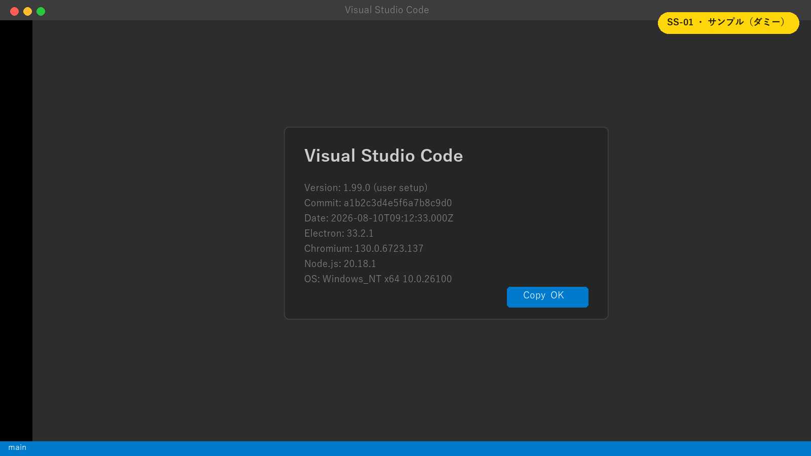
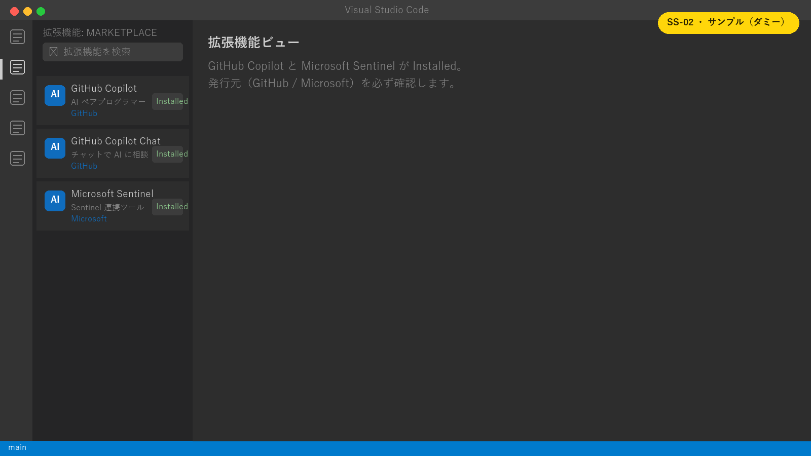
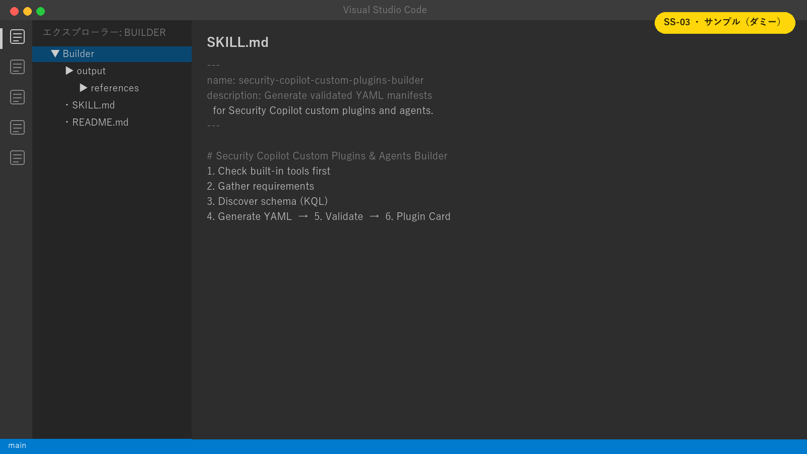

# Lab 1: 開発環境を準備する

**所要時間:** 25 分  
**ゴール:** VS Code で GitHub Copilot と custom plugins builder を使える状態にする

## 1-1. Visual Studio Code をインストールする

1. [Visual Studio Code](https://code.visualstudio.com/Download) を公式サイトからダウンロードします。
2. インストーラーを実行します。
3. VS Code を起動し、**Help > About** でバージョンを記録します。
4. 更新が表示された場合は適用して再起動します。

> [!TIP]
> **画面ショット差し替え枠 `SS-01`:** VS Code の About 画面。バージョンだけを表示し、ユーザー名や端末名はマスクします。



**期待結果:** VS Code が起動し、コマンドパレットを `Ctrl+Shift+P` で開けます。

## 1-2. 拡張機能をインストールする

1. 左側の **Extensions** を選択します。
2. `GitHub Copilot` を検索し、発行元が **GitHub** であることを確認してインストールします。
3. `Microsoft Sentinel` を検索し、発行元が **Microsoft** であることを確認してインストールします。
4. 要求された場合は VS Code を再読み込みします。

> [!NOTE]
> 拡張機能の名称や同梱関係は更新されることがあります。似た名前の第三者製拡張機能ではなく、発行元を確認してください。

> [!TIP]
> **画面ショット差し替え枠 `SS-02`:** Extensions ビューで GitHub Copilot と Microsoft Sentinel が Installed になった状態。



## 1-3. GitHub Copilot にサインインする

1. VS Code のアカウントアイコンから GitHub にサインインします。
2. 組織から Enterprise ライセンスを割り当てられたアカウントを選びます。
3. **View > Chat** を開きます。
4. 次のプロンプトを送ります。

```text
このワークスペースで README.md の見出しだけを一覧にしてください。ファイルは変更しないでください。
```

**期待結果:** Copilot がこのリポジトリの README の見出しを返します。

## Security Copilot custom plugins builder とは

[Security Copilot custom plugins builder](https://github.com/mariocuomo/Experimenting-With-Security-Copilot/tree/main/Security%20Copilot%20custom%20plugins%20builder)（[紹介記事](https://www.linkedin.com/pulse/security-copilot-custom-plugins-builder-mario-cuomo-tyjef/)）は、VS Code の GitHub Copilot 向けに作られた **AI スキル**です。「〇〇するプラグインを作って」と日本語や英語で伝えるだけで、Security Copilot のプラグイン/エージェント用 YAML マニフェストの作成を最後まで案内します。

### 何をしてくれるのか

- **要件のヒアリング:** 形式（KQL / API / GPT / LogicApp / MCP / Agent）、目的、対象、認証方式、入力、エージェントの動作を対話で整理します。
- **既存ツールの確認:** 作る前に Security Copilot の既存スキルを検索し、重複作成を防ぎます。
- **ライブスキーマ探索:** KQL では Sentinel/Defender の MCP ツールで実在するテーブルと列を確認してからクエリを書きます。
- **YAML 生成:** 公式スキーマとベストプラクティスに沿ったマニフェストを出力します。
- **検証:** 構文・意味・出力の観点でチェックリストを実行します。
- **Plugin Card 生成:** プラグインとスキルの概要をまとめた HTML カードを作ります。

KQL / API / GPT / LogicApp / MCP / Agent のすべての形式と、混合形式（KQL+GPT など）、8 種類の認証方式に対応し、22 個の完成サンプルを同梱しています。

### 手作業と比べて何が楽になるのか

| 手作業の場合 | Builder を使う場合 |
|---|---|
| マニフェストの必須項目やインデントを仕様書で確認する | 対話に答えると正しい構造で生成される |
| テーブル名や列名を推測して書き、エラーで直す | MCP で実スキーマを確認してから KQL を書く |
| 形式ごとに異なる認証設定を調べる | 形式と認証を選ぶと雛形が入る |
| アップロード後にエラー原因を手探りする | 生成前に検証チェックリストが走る |
| 仕様変更に気づかず古い書き方をする | 参照ファイルとベストプラクティスに沿う |

つまり、**YAML スキーマや KQL/OpenAPI の細部を覚えていなくても、要件を言葉で伝えるだけでレビュー可能なマニフェストの下書きが手に入る**のが最大の効果です。初心者は書式のつまずきを減らせ、経験者は定型作業を短縮できます。

> [!IMPORTANT]
> Builder はコミュニティ製の支援ツールであり、Microsoft の公式製品ではありません。生成物は下書きとして扱い、クエリ対象・時間範囲・出力件数・認証方式を人がレビューし、必ず Security Copilot 上で検証してください。公式仕様は Microsoft Learn を正とします。

## 1-4. custom plugins builder を取得する

参照する Builder はコミュニティ成果物です。内容とライセンスを確認してから演習環境へ取得します。

1. [Experimenting-With-Security-Copilot](https://github.com/mariocuomo/Experimenting-With-Security-Copilot) を開きます。
2. リポジトリを Fork するか、次のコマンドで clone します。

```powershell
git clone https://github.com/mariocuomo/Experimenting-With-Security-Copilot.git
```

3. VS Code で次のフォルダーを開きます。

```text
Security Copilot custom plugins builder/Builder
```

4. ルートに `SKILL.md`、`references`、`output` があることを確認します。
5. `SKILL.md` とリポジトリの MIT License を読み、組織の利用ルールに合うことを確認します。

> [!TIP]
> **画面ショット差し替え枠 `SS-03`:** Builder フォルダーを開いた Explorer。`SKILL.md`、`references`、`output` が見える状態。



## 1-5. Builder の応答を確認する

Copilot Chat を **Agent** モードにし、次を送ります。この時点ではファイルを作らせません。

```text
Security Copilot の KQL プラグインを作るときに、確認すべき要件だけを質問してください。まだ YAML は生成しないでください。
```

**期待結果:** 対象（Defender/Sentinel など）、目的、入力、認証、時間範囲などの確認が返ります。

返らない場合は、次を確認します。

- `Builder` フォルダーそのものをワークスペースとして開いている
- Copilot Chat が Agent モードになっている
- MCP サーバーは次の Lab で追加するため、ツール不足の警告はこの時点では許容する

## チェックポイント

- [ ] VS Code と必要な拡張機能が導入済み
- [ ] Enterprise ライセンスがある GitHub アカウントで Copilot Chat を使える
- [ ] Builder の `SKILL.md` と参照ファイルを確認した
- [ ] Builder が要件確認の質問を返した
