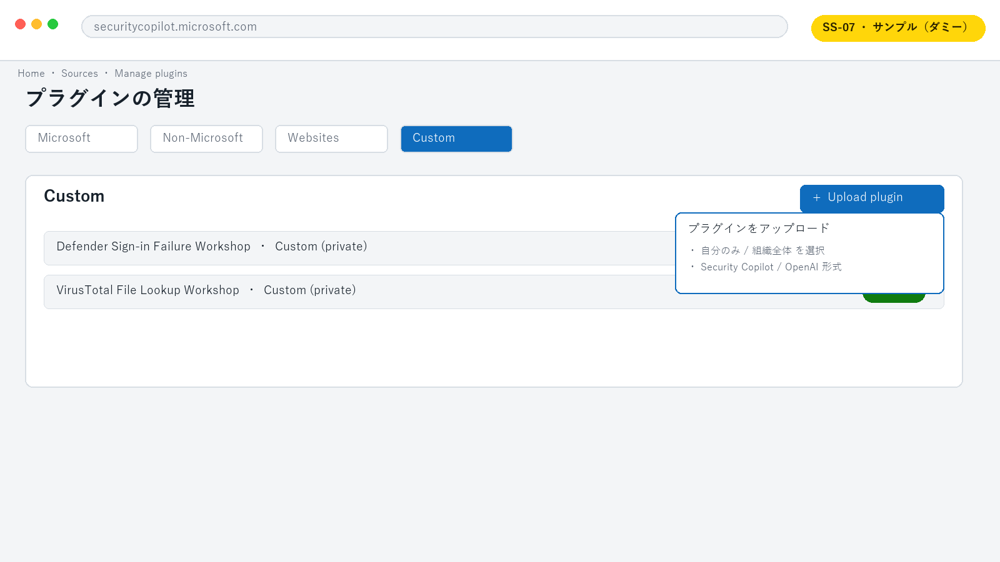

# Lab 3: Defender サインイン失敗 KQL プラグイン

**所要時間:** 30 分  
**ゴール:** 実環境のスキーマを確認し、直近のサインイン失敗だけを返す読み取り専用 KQL プラグインを作る

## こんなケースはありませんか

> 「『直近のサインイン失敗を見せて』と頼まれるたびに、同じ KQL を手で書いて実行している」——定型なトリアージ作業は頻度が高く、人によってクエリの書き方や返す列がばらつきます。

カスタム KQL プラグインにすると、**クエリをチームの共通部品として固定でき、誰が呼んでも同じ条件・同じ列で結果が返る**ようになります。アナリストは KQL を覚えていなくても自然言語で呼び出せ、調査の立ち上がりが速くなります。

> [!NOTE]
> 「KQL」はログを検索するための言語ですが、この Lab ではあなたが手で書く必要はありません。やりたいことを日本語で伝えれば、AI が下書きしてくれます。あなたの役割は、出てきた内容を一緒に確かめることです。

## 3-1. 要求を分解する

Builder を開いた Copilot Chat で、Sentinel/Advanced Hunting の MCP ツールを有効にし、次を送ります。

```text
Defender Advanced Hunting で直近 24 時間のサインイン失敗を取得する
Security Copilot KQL プラグインを作成してください。

条件:
- 生成前に利用可能なテーブルと列を MCP で確認する
- 時刻、ユーザー、エラーコード、IP アドレス、アプリケーションだけを返す
- 新しい順で最大 50 件
- 読み取り専用
- YAML を保存する前に、使用したテーブルと列が実在する根拠を示す
```

Copilot が質問した場合は、対象を `Defender`、時間範囲を `24h`、件数を `50` と答えます。

## 3-2. スキーマをレビューする

生成前に、次を確認します。

- テーブル候補が MCP の実行結果から選ばれている
- 時刻列と失敗判定列が実在する
- ユーザー ID、IP アドレスなど必要最小限の列だけを使う
- `ago(24h)` 相当の時間条件がある
- `top 50` または同等の上限がある

演習用の開始例は [defender-signin-failures.yaml](../samples/defender-signin-failures.yaml) です。列名が実環境と違う場合は、必ず MCP の結果を優先して修正します。

## 3-3. YAML をレビューする

最低限、次の構造を確認します。

```text
Descriptor
└─ Name / DisplayName / Description
SkillGroups
└─ Format: KQL
   └─ Skills
      └─ Settings
         └─ Target: Defender / Template: <KQL>
```

`Descriptor.Name` と `Skills.Name` に空白やピリオドを入れません。説明には「いつ呼ぶか」「何を返すか」を具体的に書きます。

## 3-4. Security Copilot にアップロードする

1. [Microsoft Security Copilot](https://securitycopilot.microsoft.com/) を開きます。
2. プロンプトバーの **Sources** を選択します。
3. **Manage plugins > Custom > Upload plugin** を選択します。
4. 自分だけで試す場合は個人スコープを選びます。
5. 生成した YAML をアップロードします。
6. エラーが出た場合は行番号とフィールド名を控え、Copilot にエラー全文と YAML を渡して修正します。
7. プラグインを有効にします。

> [!TIP]
> **画面ショット差し替え枠 `SS-07`:** Manage plugins の Custom と Upload plugin。



## 3-5. 正常系と異常系をテストする

正常系:

```text
Defender Sign-in Failure Workshop を使って、直近 24 時間のサインイン失敗を最大 50 件取得してください。
```

確認項目:

- [ ] 対象プラグインが呼ばれた
- [ ] 24 時間より前のデータがない
- [ ] 50 件を超えない
- [ ] 指定外の列が返らない

異常系として、該当データがない期間または演習テナントで実行し、「0 件」をエラー扱いせず説明できることを確認します。

## チャレンジ

入力 `LookbackHours` を追加する前に、許容値を 1-168 時間へ制限する方法を設計してください。KQL へ文字列を無制限に埋め込む実装は避けます。

## チェックポイント

- [ ] MCP で実スキーマを確認してから KQL を作った
- [ ] 時間範囲、列、件数を制限した
- [ ] 個人スコープでアップロードしてテストした
- [ ] 0 件の場合の挙動を確認した
