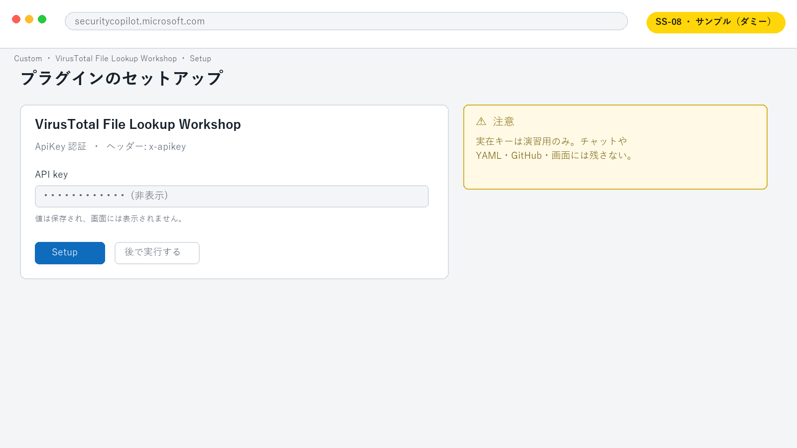

# Lab 4: VirusTotal API プラグイン

**所要時間:** 30 分  
**ゴール:** API キーをコードへ保存せず、SHA-256 ハッシュのレピュテーションを取得する API プラグインを作る

## こんなケースはありませんか

> 「怪しいファイルハッシュを見つけるたびに、別の脅威インテリサイトをブラウザで開いてコピペしている」——調査中に Security Copilot と外部サービスを行き来するのは手間で、履歴も分散します。

外部 API をプラグイン化すると、**Security Copilot の会話の中だけで外部のレピュテーション情報を取得し、自社データと組み合わせて判断できる**ようになります。ツールの往復が減り、調査の文脈を保ったままエンリッチできます。

> [!NOTE]
> 「API」は外部サービスへの問い合わせ窓口、「API キー」はその窓口を使うための合い鍵です。合い鍵は大切な秘密なので、**ファイルやチャットには書かず、Security Copilot の設定画面にだけ入力します**。不安なときはデモモード（実の API を呼ばない）で進めても OK です。

## 4-1. データ取扱いを確認する

この Lab は外部 API を使用します。実行前に次を確認します。

- 組織が VirusTotal の利用を許可している
- 演習用 API キーを利用できる
- 外部送信してよいテスト用 SHA-256 を使う
- API のレート制限と利用条件を確認した

許可されていない場合はデモモードで YAML のレビューまで行います。

## 4-2. Builder へ要求する

```text
VirusTotal v3 API で SHA-256 ハッシュのファイルレポートを取得する
Security Copilot API プラグインを作成してください。

条件:
- GET /api/v3/files/{id} だけを公開する
- ApiKey 認証を x-apikey ヘッダーで使う
- API キーの値は YAML や OpenAPI に書かない
- 入力は SHA-256 形式として説明する
- OpenAPI 3.0.x と Security Copilot マニフェストを別ファイルで生成する
- 読み取り専用で、外部送信する値を説明する
```

開始例は [virustotal-openapi.yaml](../samples/virustotal-openapi.yaml) と [virustotal-plugin.yaml](../samples/virustotal-plugin.yaml) です。

## 4-3. 公開 URL を設定する

Security Copilot の `OpenApiSpecUrl` はアクセス可能な HTTPS URL を必要とします。

1. OpenAPI ファイルを、この演習用 GitHub リポジトリへコミットします。
2. GitHub の **Raw** URL を取得します。
3. `virustotal-plugin.yaml` の `OpenApiSpecUrl` を Raw URL に置換します。
4. シークレットがコミットされていないことを差分で確認します。

プライベートリポジトリの Raw URL は Security Copilot から取得できない場合があります。その場合は、組織が承認した公開 HTTPS 配置先を使います。

## 4-4. マニフェストをレビューする

次を確認します。

- `SupportedAuthTypes` が `ApiKey`
- `Authorization.Key` が `x-apikey`
- `Authorization.Location` が `Header`
- API キーの `Value` がファイルに存在しない
- OpenAPI の操作が GET 1 つだけ
- `operationId` が一意で、説明が具体的

## 4-5. アップロードして認証する

1. Lab 3 と同じ手順でプラグイン YAML をアップロードします。
2. セットアップ画面で API キーを求められたら、演習用キーを入力します。
3. API キーが画面に表示された状態では撮影しません。
4. プラグインを有効にします。

> [!TIP]
> **画面ショット差し替え枠 `SS-08`:** API Key セットアップ画面。入力欄は空または完全にマスクした状態。



## 4-6. テストする

```text
VirusTotal File Lookup Workshop を使い、講師から指定されたテスト用 SHA-256 のレポートを取得してください。
外部へ送信する値を先に示し、ハッシュ以外は送信しないでください。
```

次の異常系も確認します。

| ケース | 期待する結果 |
|---|---|
| 64 桁でない入力 | API を呼ばず、SHA-256 が必要だと説明する |
| 未登録ハッシュ | 404 を「悪性ではない」と誤解せず、未登録と説明する |
| レート制限 | 429 と再試行方針を説明する |
| API キーなし | 設定が必要と説明し、キーをチャットで要求しない |

## チェックポイント

- [ ] API キーをファイルやチャットに保存していない
- [ ] OpenAPI の公開操作を GET 1 つに限定した
- [ ] 外部へ送る値を理解した
- [ ] 正常系と少なくとも 1 つの異常系を確認した
